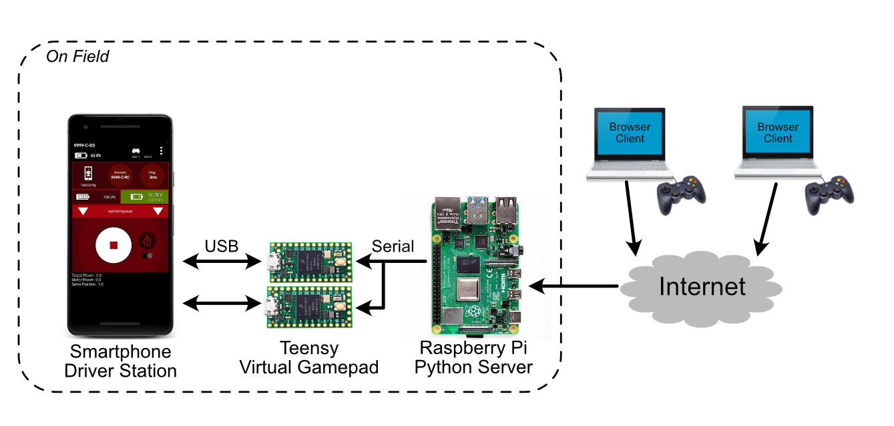
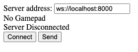
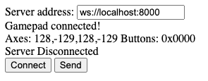
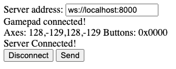
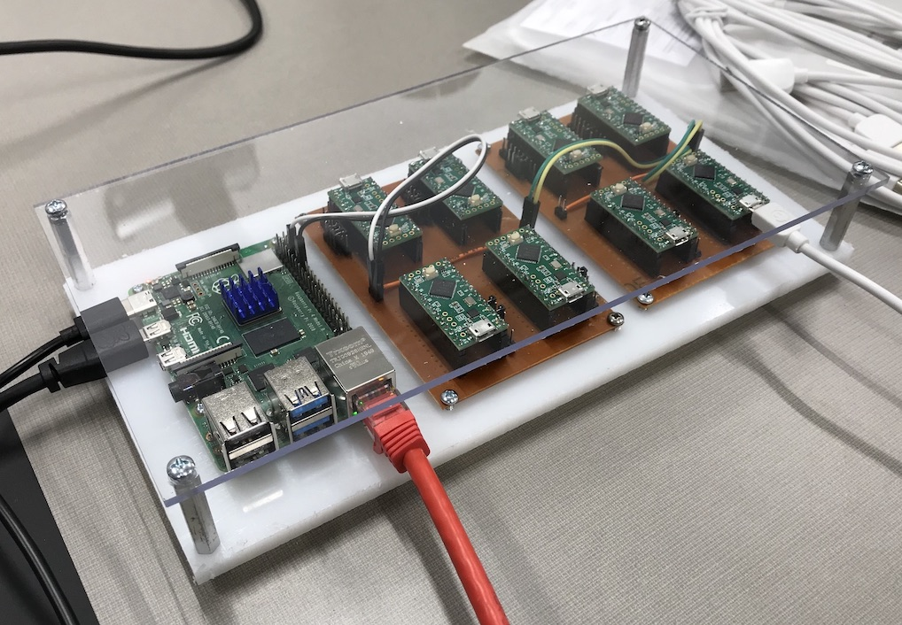

# RemoteUSBGamepad

Bridge USB gamepads over IP to enable FTC remote operation

# Client
Download the <a href="https://raw.githubusercontent.com/Tino-FRC-2473/RemoteUSBGamepad/master/client/controller_client.html" download>client page</a> (right click -> Save As) and open in a browser.  The client webpage uses the [Javascript Gamepad API](https://developer.mozilla.org/en-US/docs/Web/API/Gamepad_API), which is sufficiently supported by most modern browsers. 

1. Enter the address and port of the server you wish to connect to.

2. Then connect a gamepad to your computer and press some buttons so the browser can detect it. If you are using the Logitech F310 controller, make sure the switch on the back is set to "D" before plugging it into your computer.

3. Press the Connect button to establish connection to the server

# Server
This project uses pipenv to manage dependencies. Run `pipenv install` on first clone to download and install Python dependencies.

Run server script with `pipenv run python3 server/gamepad_bridge_server.py /dev/serial0`, replacing `/dev/serial0` with the appropriate serial UART for your system. For testing, you can add the `--dummy-serial` option to skip connecting to a physical serial port.

# Firmware
The firmware is written to run on both [Teensy boards](https://www.pjrc.com/teensy/) via the [Teensyduino Joystick API](https://www.pjrc.com/teensy/td_joystick.html) and Arduino boards via the [Arduino XInput library](https://github.com/dmadison/ArduinoXInput). Note that the XInput library requires additional installation procedures, but can run on either Arduino or Teensy boards. Also, XInput is a Microsoft API, so boards running with the XInput library will not be detected as joysticks on Mac or Linux computers without additional software.

# Teensy Carrier Board

The Teensys listen for incoming command on a common serial bus. To simplify connecting all the RX lines together to the Raspberry Pi's serial TX, we designed a simple carrier board. The first design is a single-sided prototype suitable for milling on a desktop CNC machine. Each board holds four Teensy LCs, with headers for ground and serial RX. Note that the Teensys receive power via USB, but share a common ground with the Raspberry Pi. A second set of headers allows these boards to be daisy chained to easily add additional Teensys. The address or device index for each Teensy is programmed using a set of jumpers selective pulling down GPIO pins 2-5. Each Teensy reads its ID as a binary coded number on boot based on the jumper configuration.

# Protocol
The same binary message format will be used over the Websocket and serial connection. We shall use little-endian byte order to match the Arduino/ARM processor convention. All messages start with the following header:

Field | Size (bytes) | Description 
------------ | ------------- | -------------
Index | 1 | ID of destination controller
Command ID | 1 | Numeric identifier signfying message type
Length | 2 | Length of the message body in bytes. Note this does not include this header, only the contents following.

## Connection Start Command (CID=0x00)
Signify that a client has connected to the given controller index. No message body (length = 0).

## Connection End Command (CID=0x01)
Signify that a client has disconnected from the given controller index. No message body (length = 0).

## Controller State Report (CID=0x80)
Report the controller state from client to server/device. Message body:

Field | Size (bytes) | Description 
------------ | ------------- | -------------
Joystick1_X | 2 | Joystick 1 X Axis value. Format as 16 bit signed integer.
Joystick1_Y | 2 | Joystick 1 Y Axis value
Joystick2_X | 2 | Joystick 2 X Axis value
Joystick2_Y | 2 | Joystick 2 Y Axis value
Button_state | 2 | Bitfield indicating status of controller buttons. Bit(x) = 1 if pressed, 0 if unpressed. Bits counted from LSB.
RESERVED | 2 | Unused, space reserved for padding to 4b alignment.

## XInput Controller State Report (CID=0x81)
Report a Windows XInput controller state from client to server/device. Message body:

Field | Size (bytes) | Description 
------------ | ------------- | -------------
Joystick1_X | 2 | Joystick 1 X Axis value. Format as 16 bit signed integer.
Joystick1_Y | 2 | Joystick 1 Y Axis value
Joystick2_X | 2 | Joystick 2 X Axis value
Joystick2_Y | 2 | Joystick 2 Y Axis value
Button_state | 2 | Bitfield indicating status of controller buttons. Bit(x) = 1 if pressed, 0 if unpressed. Bits counted from LSB.
Trigger_L | 1 | Trigger value, format as 8 bit unsigned integer
Trigger_R | 1 | Trigger value, format as 8 bit unsigned integer
